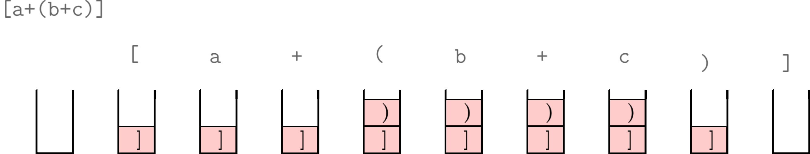

## Les chaînes de caractère en Python

Avant de commencer les exercices, voici quelques mots sur les chaînes de caractères en Python dont vous aurez besoin pendant tout au long de cette séance.

## Parenthésage

Le but de cet exercice est d'écrire un programme en Python capable de vérifier si une expression est bien parenthésée ou pas. Les trois types de parenthésage qui seront pris en compte sont les parenthèses `(`, `)`, les crochets `[`, `]` et les accolades `{`, `}`.

Votre programme doit par exemple retourner `True` pour les expressions suivantes :

* `[a+(b+c)]`

* `[((5*3)+(2*10))/2]`

et `False` pour 

* `[a+(b+c)`

* `[a+(b+c(]`

La façon la plus simple de réaliser un tel programme c'est à l'aide d'une pile. Au départ la pile est vide. Ensuite, on lit l'expression, caractère par caractère :

* Si le caractère lu est un symbole ouvrant, alors on empile le caractère fermant correspondant.

* Si le caractère lu est identique au sommet de la pile, on dépile ce caractère.

Nous pouvons constater que lorsque le parenthésage est correct, la pile sera vide après que tous les caractères sont lus.

Dans l'exemple suivant vous pouvez observer l'évolution de la pile à chaque lecture d'un nouveau caractère de l'expression `[a+(b+c)]`.

&nbsp;

&nbsp;

Voici une fonctionnalité des listes en Python qui peut vous aider dans la réalisation de votre programme :

~~~
>>> L = ['a', 'b', 'c', 'd']
>>> L.pop()
'd'
>>> print(L)
['a', 'b', 'c']
~~~

La méthode `pop()`appliquée à une liste, dépile et renvoie l'élément au sommet de la pile. La méthode `append(a)`quant à elle, ajoute l'élément `a` au sommet de la pile.

~~~
>>> L.append('e')
>>> print(L)
['a', 'b', 'c', 'e']
~~~

Pour réaliser votre programme vous pouvez suivre les étapes suivantes :

* Écrire une fonction `estOuvrante(c)` qui prend en entrée un caractère `c` et qui renvoie `True` si `c` est un symbole ouvrant.

* Écrire une fonction `fermante(c)`qui prend en entrée un caractère `c`. Si ce caractère est un symbole ouvrant, alors la fonction doit renvoyer le symbole fermant correspondant. Dans le cas contraire elle doit renvoyer le symbole `?`.

* Écrire la fonction qui vérifie le parenthèsage et testez-là. 

## Notation polonaise inverse

La [notation polonaise inverse](https://fr.wikipedia.org/wiki/Notation_polonaise_inverse) (NPI), ou notation *post-fixée* est une marnière d'écrire les expressions mathématiques en se passant des parenthèses. Elle a été introduite par le mathématicien polonais Jan Lucasievicz dans les années 1920.

Le principe de cette méthode est de placer chaque opérateur juste après ses deux opérandes. L'expression $$2 + 3$$ devient en NPI `2 3 +`.

Regardons maintenant comment peuvent s'écrire les opérations un peu plus complexes au moyen de cette notation

* $$2 + 6 - 1$$ s'écrit `2 6 + 1 -` ou bien `2 6 1 - +`

* $$5*3 + 4$$ s'écrit `5 3 * 4 +` ou bien `4 5 3 * +`

* $$((1 + 2) * 4) + 3$$ s'écrit `1 2 + 4 * 3 +` ou bien `3 4 1 2 + * +`

Évaluer une expression post-fixée est facile. Pour cela il suffit de lire l'expression de gauche à droite et d'appliquer chaque opérateur aux deux opérandes qui le précèdent. Si l'opérateur n'est pas le dernier symbole on replace le résultat intermédiaire dans l'expression et on recommence avec l'opérateur suivant.

Le but de l'exercice est de réaliser en Python une calculatrice simple, capable d'évaluer une formule en NPI et de retourner le résultat arithmétique. La réalisation d'une telle calculatrice se ferra à l'aide d'une pile.

L'algorithme est très simple. On commence par lire un par un les caractères de l'expression. Si le caractère lu est une opérande alors on l'empile. Si  le caractère lu est un opérateur, alors on dépile les deux éléments se trouvant en haut de la pile, on calcule le résultat en appliquant l'opérateur sur les deux opérandes dépilées et on empile le résultat. Une fois tous les caractères lus, la pile ne contient qu'un seul élément qui correspond au résultat final.

Voyons avec un exemple l'état de la pile après la lecture de chaque caractère de l'expression $$((1 + 2) * 4) + 3$$, ou `1 2 + 4 * 3 +` en NPI.

&nbsp;

&nbsp;

Vous pouvez remarquer que le résultat final **15** se trouve au sommet de la pile après la fin du programme.

Écrivez maintenant un programme Python qui mets en oeuvre tout cela. Les caractères autorisés sont les chiffres de 0 à 9, ainsi que les symboles $$+, -, *, /$$ correspondant aux 4 opérations élémentaires. 

Votre programme pourrait se composer des fonctions suivantes :

* Une fonction `estOperateur(c)`qui prend en entrée un caractère et renoie `True` s'il s'agit d'un opérateur et `False` sinon.

* Une fonction `calcul(op, n, m)` qui prend en entrée un opérateur `op` parmi les quatre opérateurs autorisés et deux entiers `n` et `m` et qui renvoie le résultat du calcul `n op m`.

* La fonction `evaluation(s)` qui prend en entrée une expression sous-forme de chaîne de caractères en notation polonaise inversée et renvoie le résultat du calcul.

* Testez votre programme pour le calcul de l'expression $$5*(8-3)*3+((3−1)*2)/3$$ dont l'écriture en NPI est 

`5 8 3 − * 3 * 3 1 − 2 * 3 / +`.

## Les dictionnaires en Python 

Un *dictionnaire* est une structure de données en Python qui permet d'accèder à ses éléments à l'aide d'un indice spécifique qu'on appèle la **clé**. Les informations qui y sont sauvegardés ne s'y trouvent pas dans un ordre précis (comme c'est le cas des listes), mais la clé nous aide à acceder à eux. Par exemple, un dictionnaire peut contenir un carnet téléphonique et on peut accéder au numéro de téléphone souhaité à l'aide du nom de la personne. Le nom joue alors ici le rôle de la clé.  

On reconnaît un dictionnaire au fait que ses éléments sont enfermés dans une paire d'accolades. On note alors un dictionnaire vide par `{ }`.

Supposons qu'on souhaite créer un dictionnaire pour traduire les couleurs du français en anglais.

~~~
>>> dico = {}
>>> dico['vert'] = 'green'
>>> dico['rouge'] = 'red'
>>> dico['noir'] = 'black'
>>> print(dico)
{'noir': 'black', 'vert': 'green', 'rouge': 'red'} 
~~~

Lorsque on affiche un dictionnaire, ceci apparaît sous la forme *clé-valeur*. Ici les mots français sont les clés, et les mots anglais les valeurs. Pour voir la traduction du mot *rouge* en anglais il suffit d'écrire

~~~
>>> print(dico['rouge'])
red
~~~

On peut supprimer un couple clé-valeur du dictionnaire avec la commande `del`

~~~
>>> del dico['noir']
>>> print(dico)
{'vert': 'green', 'rouge': 'red'}
~~~

On peut savoir le nombre d'entrées dans le dictionnaire à chaque instant en utilisant la fonction `len()`.

~~~
>>> print(len(dico))
2
~~~
Il possible de tester si la traduction d'une couleur se trouve dans le dictionnaire ou pas à l'aide du mot-clé `in`.

~~~
>>> couleur = "blanc"
>>> if couleur in dico :
...     print("Traduction :", dico[couleur])
... else :
...     print("La traduction de ce mot est inconnue.")
... 
La traduction de ce mot est inconnue.
~~~

Nous pouvons appliquer aux dictionnaires quelques méthodes spécifiques. La méthode `keys()`renvoie la séquence des clés utilisées dans le dictionnaire.

~~~
>>> print(dico.keys())
dict_keys(['vert', 'rouge'])
~~~

De façon analogue, la méthode `values()` permet de voir la séquence des *valeurs* qui se trouvent dans le dictionnaire.

~~~
>>> print(dico.values())
dict_values(['green', 'red'])
~~~

On peut parcourir un dictionnaire de plusieurs façons en utilisant une simple boucle `for`.

~~~
>>> for cle in dico :
...     print(cle)
... 
vert
rouge
~~~

~~~
>>> for cle in dico :
...     print(cle, dico[cle])
... 
vert green
rouge red
~~~

~~~
>>> for cle, valeur in dico.items() :
...     print(cle, valeur)
... 
vert green
rouge red
~~~

### Un premier exercice

Faites une fonction en Python qui génére un dictionnaire pour la [suite Fibonacci](https://fr.wikipedia.org/wiki/Suite_de_Fibonacci) définie comme suit :

* $$ F_0 = 0$$,
* $$ F_1 = 1 $$, 
* $$ F_{n+2} = F_{n+1} + F_{n}$$.

Les clés du dictionnaire seront les indices $$n$$ et les valeurs les termes $$F_n$$. Votre fonction `fibonacci(n)`prendra donc en argument un entier `n` et retournera le dictionnaire.

### Chiffrement par décalage

Une méthode de chiffrement très simple et connue depuis l'antiquité est le *chiffrement par décalage* qui fait partie de la famille des chiffrements par substitution. L'idée de ce chiffre est de remplacer chaque lettre du texte claire par la lettre qui se trouve $$d$$ lettres plus loin dans l'alphabet. L'instance la plus connue du chiffrement par décalage et le *chiffre de César*. Ce chiffre doit son nom à Jules César qui l'a utilisé afin de garantir la confidentialité de ses communications militaires. Dans le chiffre de César, chaque lettre de l'alphabet est remplacé par la lettre qui se trouve $$3$$ positions plus loin dans l'alphabet, c.-à-d. $$d = 3$$. Ainsi, A et remplacé par D, B par E etc. 

Afin de simplifier la mise en oeuvre, on ne considère ici que des lettres minuscules non-accentuées. Seul l'espace vide est permis entre les mots mais il ne devrait pas être remplacé par le chiffrement.

Nous utiliserons ici les *dictionnaires* afin de stocker la correspondance entre les lettres de l'alphabet clair et l'alphabet chiffré.

Ecrivez ensuite les fonctions suivante :

* Une fonction `creerDictionnaire()` qui crée et retourne le dictionnaire des correspondances. Pour cela, vous pouvez utiliser le code ASCII des lettres minuscules. Les fonctions `ord(c)`et `chr(c)` vous seront sans doute utiles :

~~~
>>> ord('a')
97
>>> chr(97)
'a'
>>> chr(ord('a') + 3)
'd'
~~~ 

* Une fonction `chiffrementLettre(l, dico)`qui prend en entrée une lettre `l`et qui renvoie la lettre chiffré correspondante selon le dictionnaire `dico`.

* Une fonction `chiffrementPhrase(p, dico)`qui prendre en entrée une phrase `p`  sous forme de chaîne de caractères et un dictionnaire `dico` et qui renvoie une nouvelle chaîne de caractères, correspondant au chiffré de `p`.

* Une fonction `inverseDictionnaire(dico)` qui prend en entrée le dictionnaire que vous avez construit et qui renvoie un nouveau dictionnaire qui inverse les clefs et les valeurs du dictionnaire `dico`. Testez-la en déchiffrant la phrase que vous venez juste de chiffer.

