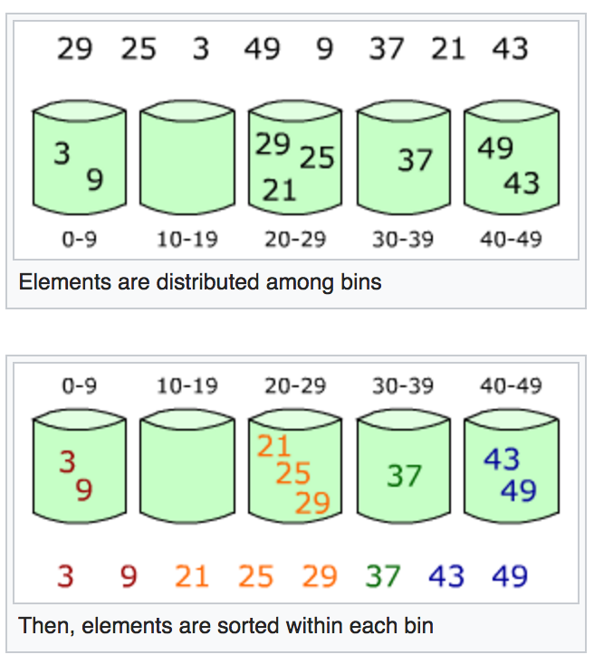

## Tri à bulles (bubble sort)

Le *tri à bulles* est un algorithme de tri très simple dont le principe est de faire remonter à chaque étape le plus grand élément du tableau à trier, comme les bulles d'air remontent à la surface de l'eau (d'où le nom de l'algorithme).

Commençons par un exemple du fonctionnement de l'algorithme. Supposons qu'on souhaite trier la suite de nombres 

$$[5, 1, 2, 4, 3].$$ 

Voici comment se passe le premier *passage*.

~~~python
[5, 1, 2, 4, 3] # On compare 5 et 1 et on les inverse.
[1, 5, 2, 4, 3] # On compare 5 et 2 et on les inverse.
[1, 2, 5, 4, 3] # On compare 5 et 4 et on les inverse.
[1, 2, 4, 5, 3] # On compare 5 et 3 et on les inverse.
[1, 2, 4, 3, 5] # Fin du premier passage.
~~~

Comme on peut le voir, l'algorithme compare à chaque fois des éléments adjacents et les échange s'ils ne sont pas dans l'ordre. À la fin de ce premier passage, l'élément le plus grand du tableau (ici l'élément 5) se retrouve à la fin du tableau à sa position définitive. Le tableau n'est cependant pas encore complètement trié et nous devons donc continuer par un nouveau passage. Lors de ce nouveau passage on peut ignorer la dernière case du tableau, car celle-ci contient déjà l'élément le plus grand et ne nécessite donc pas d'être traitée à nouveau.  

~~~python
[1, 2, 4, 3, 5] # On compare 1 et 2 et on ne fait rien.
[1, 2, 4, 3, 5] # On compare 2 et 4 et on ne fait rien.
[1, 2, 4, 3, 5] # On compare 4 et 3 et on les inverse.
[1, 2, 3, 4, 5] # Fin du deuxième passage
~~~

On recommence par faire un nouveau passage pour les 3 premières cases du tableau qui ne sont potentiellement pas encore dans l'ordre.

Voici le pseudo-code du tri à bulles (version non-optimisée), où $$n$$ est la longueur du tableau T à trier.

~~~
Tri-Bulles(T)
    pour i de n-1 à 1 // (pas -1)
        pour j de 0 à i - 1
            si T[j] > T[j+1]
               T[j] <-> T[j+1] // inverser T[j] et T[j+1]
~~~

**:**{:.exercise} 

* Implémentez cette version de l'algorithme en Python et testez-là en lui donnant en entrée une liste aléatoire de nombres entiers. Pour générer une liste `L` de `t` nombres entiers aléatoires compris dans l'interval `[a, b)`on peut écrire :

~~~python
L = random.sample(range(a, b), t)
~~~

Par exemple, pour générer une liste de 10 entiers compris entre 0 et 99 il suffit d'écrire :

~~~python
>>> import random
>>> L = random.sample(range(0, 100), 10)
>>> L
[41, 21, 38, 20, 69, 14, 10, 50, 76, 9]
~~~

* Pourquoi la version de l'algorithme que vous venez d'implémenter n'est pas optimale ? Pour répondre à cette question, on peut remarquer que dans l'exemple précédent le tableau est déjà trié après seulement le deuxième passage. Dans ce cas, a-t-on besoin d'exécuter l'algorithme jusqu'à la fin ?

* Réfléchissez à une façon de rendre l'algorithme plus optimisé. Implémentez cette méthode et testez-là.

* Quel est le temps d'exécution de cet algorithme dans le cas le plus défavorable ? Et dans le cas le plus favorable ?

* Calculez en pratique le temps d'exécution de vos deux tris (version naïve et version optimisée). Pour cela, il faut introduire au début de votre script le module `time` en écrivant `import time`. Débutez le compteur en insérant l'instruction `debut = time.time()` et arrêtez-le avec l'instruction `fin = time.time()`. Imprimez le temps en secondes écoulé en écrivant `print("Le temps en secondes écoulé pour faire le tri est", fin-debut)`. Afin de pouvoir observer la différence, générez de tableaux de taille significative (par exemple de taille 50000). 

## Tri par sélection (selection sort)

Le tri par sélection est encore un algorithme de tri qui a l'avantage d'être simple à mettre en oeuvre. L'idée de ce tri est la suivante : 
  - rechercher le plus petit élément du tableau et le placer à la première position, 
  - rechercher ensuite le deuxième élément le plus petit et le placer en deuxième position,
  - continuer de la même façon jusqu'à ce que le tableau soit entièrement trié.

Le tableau est alors divisé en deux parties : la partie gauche avec les éléments déjà triés et la partie droite occupée par les éléments pas encore traités. Au départ, la partie gauche est vide. L'algorithme recherche à chaque fois le plus petit élément de la partie droite (qui au début est le tableau entier) et l'échange avec l'élément le plus à gauche de la partie de droite. À la fin de chaque étape la limite droite de la partie de gauche est avancée d'une position vers la droite.

Voici un exemple du fonctionnement de l'algorithme sur le tableau `[10, 9, 5, 7, 3]`.

~~~python
[10, 9, 5, 7, 3]    # Tableau à trier
[3,| 9, 5, 7, 10]   # 3 est le plus petit élément. On l'échange avec 10. Sous-tableau gauche trié : [3]
[3, 5,| 9, 7, 10]   # On échange 5 avec 9. Sous-tableau gauche trié : [3,5]
[3, 5, 7,| 9, 10]   # On échange 7 avec 9. Sous-tableau gauche trié : [3,5,7] 
[3, 5, 7, 9,| 10]   # Sous-tableau gauche trié : [3,5,7,9] 
[3, 5, 7, 9, 10]    # Sous-tableau gauche trié : [3,5,7,9,10]. Fin. 
~~~

* Faites un pseudo-code pour cet algorithme et implementez-le ensuite en Python. 

* Quelle est la complexité de cet algorithme dans le pire cas ?

* Comparez son temps d'exécution en pratique avec l'algorithme du tri à bulles implementé précédemment. De façon générale, le tri par sélection est plus rapide que le tri à bulles, mais plus lent que le tri par insertion. 

## Tri fusion (merge sort) 

Le tri fusion se base sur le principe diviser pour régner.

 - Si le tableau a une seule case, alors il est considéré comme trié.
 - Sinon, on découpe le tableau en deux parties de même taille (à une case près, si le nombre d'éléments du tableau est impair) et on trie chacune des deux parties.
 - On fusionne les deux parties triées.

* Appliquez le tri fusion *à la main* pour trier le tableau `[5, 2, 4, 7, 1, 3, 2, 6]`.

* Implémentez en Python le tri fusion vu en cours et testez-le sur un tableau de taille 1000 contenant des nombres aléatoires de 0  à 10000.

* Comparez en pratique son temps d'exécution aux autres algorithmes de tri implementés précédemment.

## Tri par paquets (bucket sort) 

L'idée derrière ce tri est de distribuer les éléments à trier dans des urnes (ou paquets). Chaque urne est ensuite triée en utilisant un algorithme de tri efficace pour des entrées de petite taille, comme par exemple le tri par insertion.

Dans l'exemple ci-dessous (source [en.wikipedia.org](https://en.wikipedia.org/wiki/Bucket_sort)), le tableau `[29, 25, 3, 49, 37, 21, 43]` est trié en utilisant le tri par paquets. Dans cet exemple, cinq urnes sont allouées. La première contiendra les éléments 0-9, la deuxième les éléments 10-19, etc. On met chaque élément dans l'urne correspondante, puis on trie toutes les urnes une par une (en utilisant le tri par insertion par exemple). La dernière étape consiste à mettre le contenu de chaque urne bout-à-bout afin de créer le tableau trié. 

{: style="width:442px;margin: 1.5em 0"}
{:.centered}

Le tri par paquets fonctionne bien si les éléments sont uniformément distribués sur un espace. Dans ce cas, si le nombre d'urnes est proportionnel au nombre d'éléments à trier, le temps d'exécution en moyenne est $$\Theta(n)$$. Cependant, la complexité peut vite devenir quadratique si les éléments ne sont pas uniformément distribués et qu'il y a donc des urnes qui contiennent beaucoup plus d'éléments que d'autres. Le pire cas survient notamment si tous les éléments à trier finissent dans une seule urne tandis que les autres urnes restent vides. Dans ce cas, la complexité est donné par le temps d'exécution du tri par insertion sur l'unique urne non-vide et ce temps est comme on le sait quadratique.

* Implantez le tri par paquets en suivant les étapes suivantes :

 - Initialisez une liste de listes (urnes) vides.

 - Parcourez le tableau à trier et mettez chaque élément dans l'urne qui lui correspond.

 - Triez chaque urne en utilisant le tri par insertion.

 - Parcourez les urnes dans l'ordre et remettez les éléments dans le tableau initial.

* Testez votre implémentation sur un tableau de grande taille généré aléatoirement. Comparez ses performances aux autres algorithmes de tri.

## Autres algorithmes de tri

Implémentez les deux autres algorithmes de tri vus en cours (**tri par insertion** et **tri rapide**).
